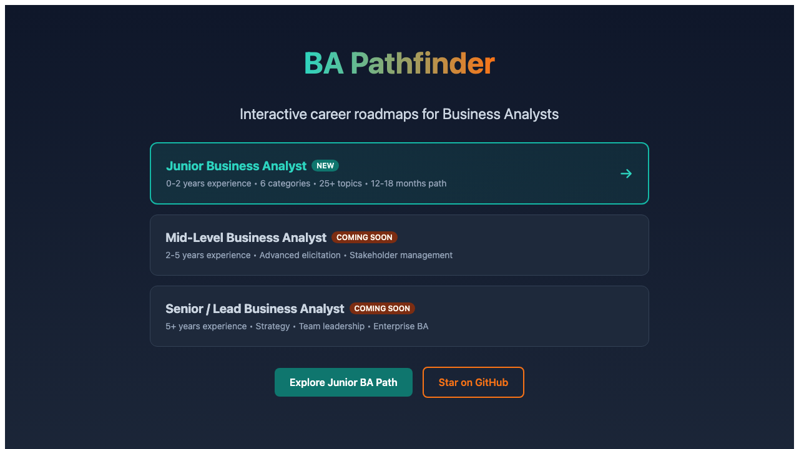

# BA Pathfinder

<p align="center">
  
</p>

<p align="center">
  <strong>Interactive career roadmaps for Business Analysts.</strong>
</p>

<p align="center">
  <a href="https://ba-pathfinder.projectlavos.com">Live Demo</a> ·
  <a href="#available-roadmaps">Roadmaps</a> ·
  <a href="#the-synthesis-approach">Approach</a>
</p>

<p align="center">
  <a href="https://ba-pathfinder.projectlavos.com"></a>
  <a href="https://opensource.org/licenses/MIT"></a>
</p>

---

## The Problem

**The BA career path is unclear.**

- No standard progression from Junior to Senior to Director
- Certifications scattered (CBAP, CCBA, PMI-PBA, Scrum certs) with unclear ROI
- Tool proficiency varies wildly by industry (Jira vs Azure DevOps vs spreadsheets)
- Career advice is generic: "get more experience" isn't actionable

New BAs don't know what to learn. Experienced BAs don't know what's next.

---

## The Synthesis Approach

I mapped the BA career domain by studying:
- Job postings across industries and levels
- Certification requirements and outcomes
- Tool adoption patterns by company size
- Career trajectories of successful BAs

**Result:** Structured roadmaps from Junior BA to Director/VP, with clear skill progressions, certification paths, and tool mastery guides.

---

## Available Roadmaps

| Level | Experience | Focus |
|-------|------------|-------|
| **Junior BA** | 0-2 years | Fundamentals, first certifications, core tools |
| **Mid-Level BA** | 2-5 years | Specialization, stakeholder management, process ownership |
| **Senior BA** | 5+ years | Strategic influence, mentoring, domain expertise |
| **Product Owner** | Agile track | Scrum mastery, backlog ownership, stakeholder alignment |
| **Business Systems Analyst** | Technical track | SQL, system integrations, technical requirements |
| **Data Analyst** | Analytics track | Power BI, SQL, data modeling, visualization |
| **Director/VP BA** | Leadership | Team building, BA practice establishment, executive communication |

---

## What Each Roadmap Includes

- **Visual learning path** - Click nodes to explore topics
- **Skill progressions** - What to learn in what order
- **Certification guidance** - Which certs matter at which level
- **Tool recommendations** - What to master, what to know
- **Resources** - Books, courses, communities that actually help

---

## The Method

This project demonstrates domain synthesis:

1. **Enter unfamiliar domain** (BA career progression)
2. **Map patterns and structures** (levels, skills, certifications, tools)
3. **Build validation system** (interactive roadmaps with progress tracking)
4. **Deliver operator-ready artifact** (BAs can navigate their own path)

The chaos of "how do I advance my BA career?" becomes a structured, navigable map.

---

## Tech Stack

- **Frontend:** Next.js, React, TypeScript
- **Styling:** Tailwind CSS
- **Roadmap Rendering:** Interactive SVG components
- **Content:** Structured JSON data
- **Deployment:** Vercel

---

## Quick Start

```bash
git clone https://github.com/guitargnarr/ba-pathfinder
cd ba-pathfinder
npm install
npm run dev
```

Open [http://localhost:3000](http://localhost:3000)

---

## Roadmap Structure

Each career path follows consistent structure:

```
Foundations
├── Business Analysis Fundamentals
├── Stakeholder Management
├── Requirements Elicitation
└── Documentation Techniques

Core Skills
├── Requirements Analysis
├── Process Modeling
├── Data Modeling
└── Solution Evaluation

Tools & Technology
├── Collaboration (Jira, Confluence)
├── Diagramming (Lucidchart, Draw.io)
├── Data (SQL, Excel, Power BI)
└── Testing (basics for BA context)

Domain Knowledge
├── Industry-Specific Knowledge
├── Regulatory & Compliance
├── Financial Acumen
└── Technical Literacy

Career Development
├── Certifications
├── Professional Networking
├── Thought Leadership
└── Continuous Learning
```

---

## Why This Exists

I spent a decade navigating regulated industries (healthcare, CMS compliance) as a hybrid BA/QA/technical role. The path was never clear - I figured it out through trial and error.

This roadmap is what I wish I had when I started.

---

## Author

**Matthew Scott** - AI-Enabled Strategist & Synthesist

10 years navigating complex domains. Now I map them for others.

- [Portfolio](https://resume.projectlavos.com)
- [GitHub](https://github.com/guitargnarr)
- [LinkedIn](https://linkedin.com/in/mscott77)

---

## Contributing

Found something missing? Know a better resource? PRs welcome.

This is a living document - the BA field evolves, and so should these roadmaps.

---

## License

MIT - Use it, fork it, adapt it for your team.
