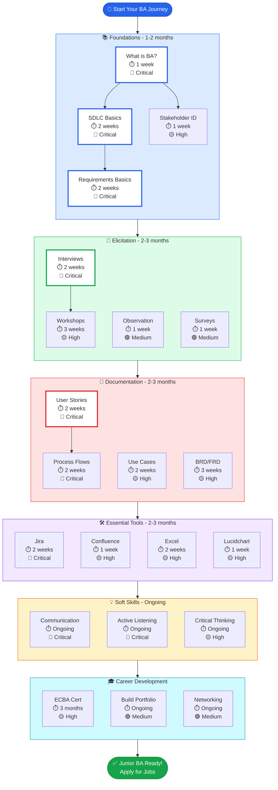

# Junior Business Analyst Roadmap - Visual Guide

**Estimated Time to Complete:** 12-18 months
**Difficulty:** Beginner
**Target Role:** Junior Business Analyst (0-2 years experience)

---

## 🗺️ Interactive Roadmap

---

## 📋 Reading the Roadmap

### Priority Levels
- 🔴 **Critical** - Must complete before proceeding to next level
- 🟡 **High Priority** - Important for success but some flexibility
- 🟢 **Medium Priority** - Helpful but can be learned on the job

### Time Estimates
- Individual topics: 1-3 weeks each
- Categories: 1-3 months each
- **Total roadmap:** 12-18 months (part-time study)

---

## 🚀 Quick Start Guide

### If You're Brand New to BA
**Start Here:** 📚 Foundations
1. [What is Business Analysis?](/content/roadmaps/junior-ba/what-is-ba.md) - 1 week
2. [SDLC Fundamentals](/content/roadmaps/junior-ba/sdlc-basics.md) - 2 weeks
3. [Requirements Fundamentals](/content/roadmaps/junior-ba/requirements-basics.md) - 2 weeks

**Goal:** Understand BA role and fundamentals

---

### If You're Transitioning from QA/Testing
**Focus On:** 🎤 Elicitation
1. Skip "What is BA?" (you understand the context)
2. Review SDLC Basics (refresh)
3. **Deep dive:** [Conducting Interviews](/content/roadmaps/junior-ba/interviews.md)
4. **Deep dive:** [Writing User Stories](/content/roadmaps/junior-ba/user-stories.md)

**Goal:** Strengthen requirements gathering skills

---

### If You're Aiming for a Specific Certification
**Target:** 🎓 Career Development
1. Complete Foundations + Elicitation + Documentation first
2. Join IIBA (21 hours professional development required)
3. Study BABOK Guide v3
4. Take [ECBA Certification](/content/roadmaps/junior-ba/ecba-prep.md)

**Timeline:** 6-9 months total

---

## 📍 Your Current Position

### Phase 1: Foundations (Months 1-2)
**Complete these topics:**
- ✅ [What is Business Analysis?](/content/roadmaps/junior-ba/what-is-ba.md)
- ✅ [SDLC Fundamentals](/content/roadmaps/junior-ba/sdlc-basics.md)
- ✅ [Requirements Fundamentals](/content/roadmaps/junior-ba/requirements-basics.md)
- ✅ [Stakeholder Identification](/content/roadmaps/junior-ba/stakeholder-identification.md)

**Milestone:** You understand BA fundamentals and can explain the role confidently

---

### Phase 2: Elicitation (Months 3-5)
**Complete these topics:**
- ✅ [Conducting Interviews](/content/roadmaps/junior-ba/interviews.md)
- ✅ [Facilitated Workshops](/content/roadmaps/junior-ba/workshops.md)
- ⏳ Observation & Job Shadowing (coming soon)
- ⏳ Surveys & Questionnaires (coming soon)

**Milestone:** You can confidently gather requirements from stakeholders

---

### Phase 3: Documentation (Months 6-8)
**Complete these topics:**
- ✅ [Writing User Stories](/content/roadmaps/junior-ba/user-stories.md)
- ⏳ Use Case Documentation (coming soon)
- ⏳ Process Flow Diagrams (coming soon)
- ⏳ Requirements Documents (BRD/FRD) (coming soon)

**Milestone:** You can create professional BA deliverables

---

### Phase 4: Tools (Months 9-11)
**Master these tools:**
- ⏳ Jira for BAs (coming soon)
- ⏳ Confluence Documentation (coming soon)
- ⏳ Excel for BAs (coming soon)
- ⏳ Lucidchart Diagramming (coming soon)

**Milestone:** You're proficient with industry-standard BA tools

---

### Phase 5: Career Launch (Month 12+)
**Achieve these goals:**
- ⏳ ECBA Certification (coming soon)
- ⏳ Build BA Portfolio (coming soon)
- ⏳ Professional Networking (coming soon)

**Milestone:** You're ready for mid-level BA roles!

---

## 📊 Progress Tracking

### Completed Topics: 7 / 25
- ✅ What is Business Analysis?
- ✅ SDLC Fundamentals
- ✅ Requirements Fundamentals
- ✅ Stakeholder Identification
- ✅ Conducting Interviews
- ✅ Writing User Stories
- ✅ Facilitated Workshops

### In Progress: 0 / 25

### Not Started: 18 / 25

**Overall Completion:** 28% (7/25 topics)

---

## 🎯 Practice Projects

Apply your learning with these hands-on projects:

### Beginner Project: Online Banking Bill Pay
**Skills:** Stakeholder analysis, user stories, process flows
**Deliverables:**
- Stakeholder register (5-8 stakeholders)
- 10 user stories with acceptance criteria
- Process flow diagram (current vs future state)
- Basic wireframe/mockup

**Estimated Time:** 10-15 hours

---

### Intermediate Project: E-Commerce Checkout Redesign
**Skills:** Requirements elicitation, documentation, testing
**Deliverables:**
- Interview notes (3-5 stakeholders)
- Use case document
- Test cases (UAT plan)
- Requirements traceability matrix

**Estimated Time:** 20-30 hours

---

## 📚 Recommended Learning Sequence

**Months 1-2:** Foundations
→ **Months 3-5:** Elicitation
→ **Months 6-8:** Documentation
→ **Months 9-11:** Tools
→ **Month 12+:** Career Development

**Total:** 12-18 months to Junior BA proficiency

---

## 💡 Tips for Success

### 1. Don't Rush
Quality > Speed. Master each topic before moving on.

### 2. Practice Daily
Even 30 minutes/day adds up to 180 hours/year

### 3. Build Portfolio
Document everything you learn (real or practice projects)

### 4. Join Communities
- IIBA local chapters
- r/businessanalysis
- LinkedIn BA groups

### 5. Get Mentorship
Find a senior BA who can review your work and provide guidance

---

## 🔗 Additional Resources

### Books
- "Business Analysis for Beginners" by Mohamed Elgendy
- "A Guide to the Business Analysis Body of Knowledge (BABOK Guide v3)" by IIBA
- "User Stories Applied" by Mike Cohn

### Online Courses
- LinkedIn Learning: "Getting Started as a Business Analyst"
- Udemy: "Business Analysis Fundamentals - ECBA, CCBA, CBAP endorsed"
- Coursera: "Business Analysis & Process Management"

### Certifications
- ECBA (Entry Certificate in Business Analysis) - IIBA
- CBAP (Certified Business Analysis Professional) - IIBA
- PMI-PBA (Professional in Business Analysis) - PMI

---

## ❓ FAQ

### How long does it take to become job-ready?
**Answer:** 6-12 months of dedicated study (10-15 hours/week) + portfolio projects

### Do I need a certification to get hired?
**Answer:** No, but ECBA helps (especially for career changers)

### Can I skip topics?
**Answer:** Focus on Critical (🔴) topics first. Medium priority topics can be learned on the job.

### What if I get stuck?
**Answer:**
- Ask in [GitHub Discussions](https://github.com/guitargnarr/ba-pathfinder/discussions)
- Join IIBA local chapter
- Find a mentor

---

**Ready to start?**
➡️ [Begin with "What is Business Analysis?"](/content/roadmaps/junior-ba/what-is-ba.md)

---

*This roadmap is aligned with IIBA BABOK Guide v3 and reflects current industry practices (2025)*
